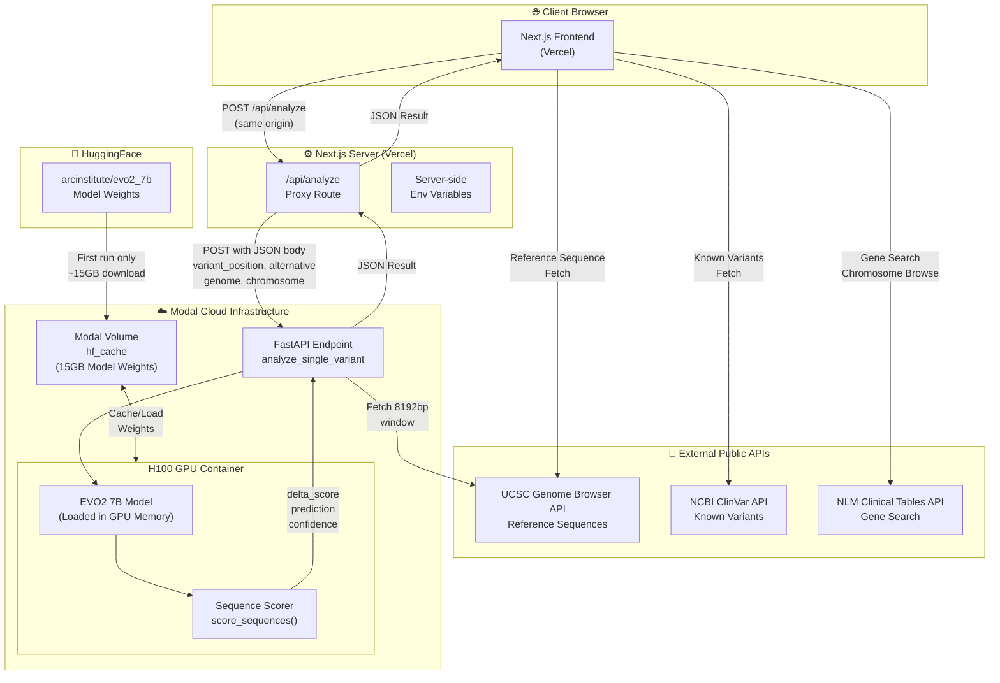
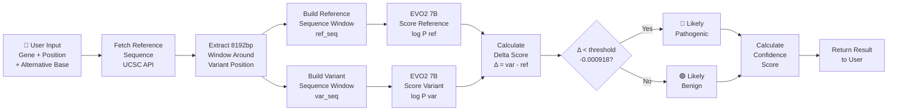
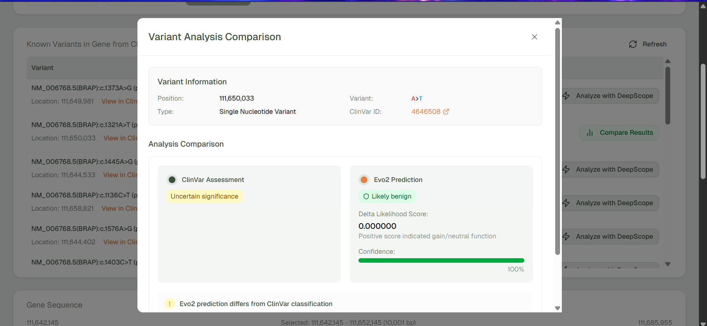

# DeepScope - Genomic and Chromosomal Variant Analysis

> **AI-powered genomic variant effect prediction using the EVO2 deep learning model**

DeepScope is a full-stack biotech web application that predicts the pathogenicity of single nucleotide variants (SNVs) in human DNA. It leverages the state-of-the-art **EVO2 7B genomic language model** deployed on serverless H100 GPUs via Modal, combined with a modern Next.js frontend for an intuitive research experience.

---

## 👥 Team

| Name | Role |
|------|------|
| **Aprajita Ranjan** | AI/ML Engineer — EVO2 Model Integration, GPU Backend Architecture & Modal Deployment |
| **Priyanshu Paul** | Full-Stack Engineer — Frontend Development, API Integration & Data Pipeline |

---

## 🧬 What is DeepScope?

DNA is composed of four nucleotide bases: **A**, **T**, **G**, and **C**. Small changes (mutations) at specific positions — called **Single Nucleotide Variants (SNVs)** — can have varying impacts on human health. For example, a single base change in the BRCA1 gene can significantly increase cancer risk.

DeepScope uses the EVO2 genomic language model to score the **log-likelihood delta** between a reference sequence and a mutated sequence, classifying variants as:
- 🔴 **Likely Pathogenic** — variant reduces genomic fitness
- 🟢 **Likely Benign** — variant has minimal impact

---

## ✨ Features

- 🧬 **EVO2 7B Model** — state-of-the-art DNA language model for variant effect prediction
- 🩺 **SNV Pathogenicity Prediction** — classify variants as pathogenic or benign with confidence scores
- ⚖️ **ClinVar Comparison** — compare EVO2 predictions against existing clinical classifications
- 💯 **Confidence Estimation** — quantified prediction confidence using ROC-derived thresholds
- 🌍 **Genome Assembly Selector** — supports hg38 and other UCSC assemblies
- 🗺️ **Gene Browser** — browse by chromosome or search genes (e.g., BRCA1, BRAF)
- 🌐 **Live Reference Sequences** — fetched in real-time from UCSC Genome Browser API
- 🔬 **Known Variant Explorer** — powered by NCBI ClinVar / E-utilities API
- ⚡ **H100 GPU Acceleration** — serverless GPU inference via Modal
- 📱 **Responsive Interface** — modern UI built with Tailwind CSS and Shadcn UI

---

## 🏗️ System Architecture



---

## 🔄 Analysis Pipeline



---

## 🛠️ Tech Stack

### Backend
| Technology | Purpose |
|---|---|
| Python 3.12 | Core language |
| Modal | Serverless GPU deployment |
| FastAPI | REST API framework |
| EVO2 7B | Genomic language model |
| H100 GPU | Hardware accelerator |
| HuggingFace Hub | Model weight hosting |

### Frontend
| Technology | Purpose |
|---|---|
| Next.js 16 | React framework |
| TypeScript | Type safety |
| Tailwind CSS | Styling |
| Shadcn UI | Component library |
| T3 Stack | Project scaffold |
| Vercel | Frontend hosting |

### External APIs
| API | Data Provided |
|---|---|
| UCSC Genome Browser | Reference genome sequences |
| NCBI ClinVar / E-utilities | Known variant classifications |
| NLM Clinical Tables | Gene search |

---

## 🚀 Setup & Deployment

### Prerequisites
- Python 3.12
- Node.js 20+
- Modal account (free) — https://modal.com
- HuggingFace account (free) — https://huggingface.co

### Backend Setup

```bash
cd evo2-backend
python -m venv venv
.\venv\Scripts\activate        # Windows
source venv/bin/activate       # Mac/Linux
pip install -r requirements.txt
modal setup                    # Authenticate with Modal
modal run main.py              # Test run
modal deploy main.py           # Deploy to production
```

### Frontend Setup

```bash
cd evo2-frontend
npm install
cp .env.example .env
# Edit .env and add your Modal deployment URL
npm run dev                    # Development server
```

### Environment Variables

```env
# evo2-frontend/.env
BACKEND_URL=https://your-username--genome-analysis-v2-evo2model-analyze-single-variant.modal.run
NEXT_PUBLIC_ANALYZE_SINGLE_VARIANT_BASE_URL=/api/analyze
```

---

## 📁 Project Structure

```
deepscope/
├── evo2-backend/
│   ├── evo2/                  # EVO2 model submodule
│   ├── main.py                # Modal app + FastAPI endpoint
│   └── requirements.txt       # Python dependencies
├── evo2-frontend/
│   ├── src/
│   │   ├── app/
│   │   │   ├── api/analyze/   # Backend proxy route
│   │   │   ├── layout.tsx
│   │   │   └── page.tsx
│   │   ├── components/        # React components
│   │   │   ├── gene-information.tsx
│   │   │   ├── gene-sequence.tsx
│   │   │   ├── gene-viewer.tsx
│   │   │   ├── known-variants.tsx
│   │   │   ├── variant-analysis.tsx
│   │   │   └── variant-comparison-modal.tsx
│   │   └── utils/
│   │       └── genome-api.ts  # All API calls
│   └── package.json
├── evo2.excalidraw             # Architecture diagram
└── README.md
```

---


## Results - Comparison of hg-38-Dec2013[(Genome: BRCA1 protein variant), (Variant: NM_006768.5(BRAP):c.1321A>T (p.Met441Leu))]



## 🧪 How to Use

1. **Select Genome Assembly** — choose `hg38` (human genome, latest)
2. **Find a Gene** — search by name (e.g., `BRCA1`) or browse by chromosome
3. **View Reference Sequence** — the gene's DNA sequence is fetched live
4. **Enter a Variant** — input a genomic position and alternative base (e.g., A→G)
5. **Analyze** — DeepScope calls EVO2 and returns a pathogenicity prediction
6. **Compare** — view side-by-side comparison with ClinVar clinical classifications

---

## 📊 Model Details

**EVO2 7B** is a genomic language model trained on 8.8 trillion tokens from all domains of life using the StripedHyena 2 architecture.

- **Variant Scoring Method**: Log-likelihood delta (Δ = log P(variant) − log P(reference))
- **Classification Threshold**: −0.0009178519 (derived from BRCA1 ROC analysis)
- **Context Window**: 8,192 base pairs around the variant position
- **Confidence**: Normalized distance from threshold using class-specific standard deviations

---
