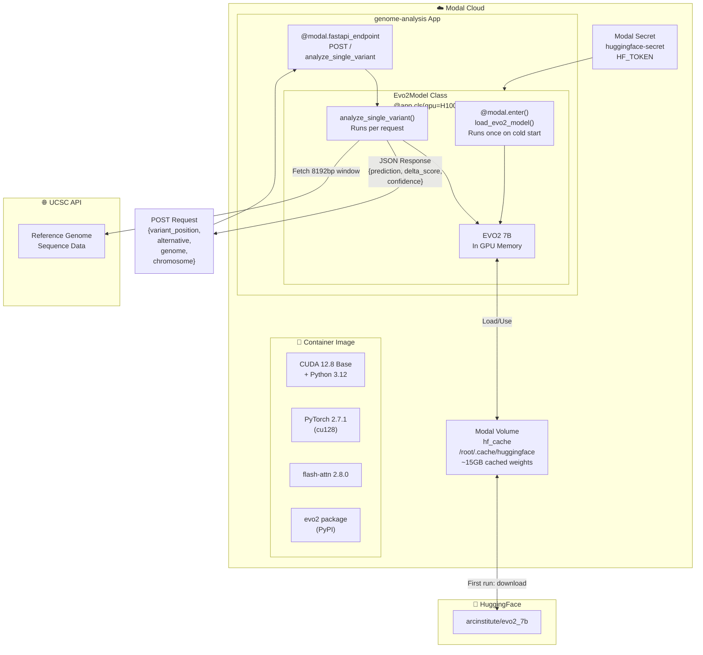
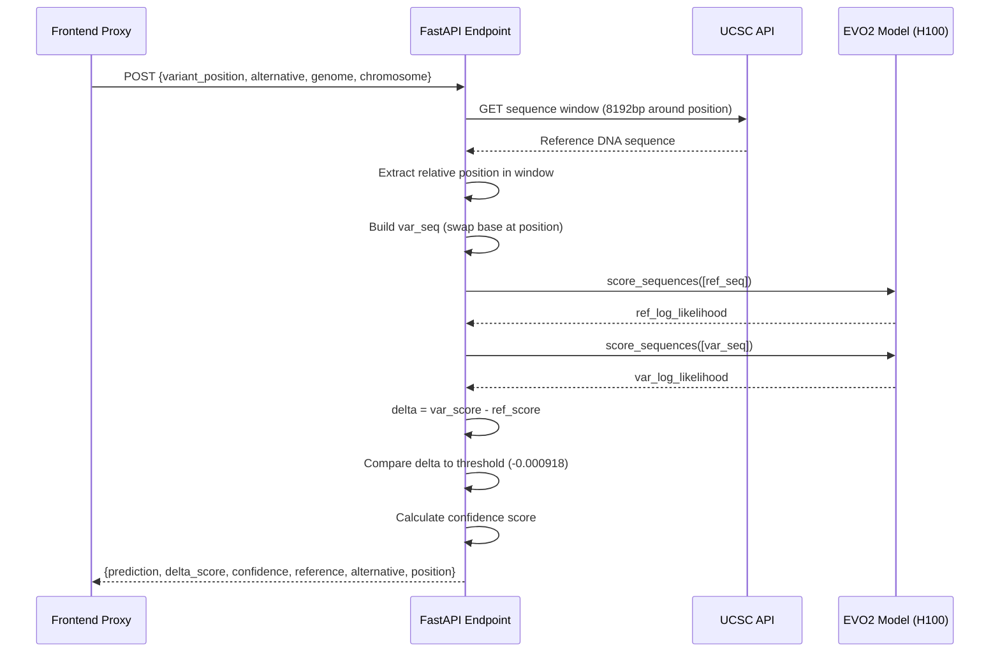

# DeepScope — Backend

> EVO2 Model Deployment & FastAPI Inference Engine

This is the backend for DeepScope. It deploys the **EVO2 7B genomic language model** on a serverless **H100 GPU** using [Modal](https://modal.com), exposing a FastAPI endpoint for variant effect prediction.

**Built by: Aprajita Ranjan** — AI/ML Engineer, EVO2 Model Integration & Modal Deployment

---

## 🏗️ Backend Architecture



---

## 🔄 Inference Pipeline



---

## 📁 File Structure

```
evo2-backend/
├── evo2/                    # ArcInstitute EVO2 git submodule
│   ├── evo2/                # Core model code
│   ├── notebooks/           # BRCA1 analysis notebooks
│   └── pyproject.toml
├── main.py                  # Modal app definition + FastAPI endpoint
└── requirements.txt         # Python dependencies
```

---

## 🧠 main.py — Key Components

### 1. Container Image Definition
```python
evo2_image = (
    modal.Image.from_registry("nvidia/cuda:12.8.0-devel-ubuntu22.04", add_python="3.12")
    .run_commands("pip install torch==2.7.1 --index-url https://download.pytorch.org/whl/cu128")
    .run_commands("pip install flash-attn==2.8.0.post2 --no-build-isolation")
    .run_commands("pip install evo2")
    ...
)
```

### 2. EVO2Model Class (H100 GPU)
```python
@app.cls(gpu="H100", volumes={mount_path: volume}, ...)
class Evo2Model:
    @modal.enter()
    def load_evo2_model(self):
        self.model = Evo2("evo2_7b")   # Loaded once, stays in GPU memory

    @modal.fastapi_endpoint(method="POST")
    def analyze_single_variant(self, request: VariantRequest):
        # Fetch sequence → Score → Return prediction
```

### 3. Scoring Logic
```python
delta_score = var_score - ref_score

threshold   = -0.0009178519   # Optimal threshold from BRCA1 ROC
lof_std     =  0.0015140239   # Std dev of loss-of-function scores
func_std    =  0.0009016589   # Std dev of functional scores

if delta_score < threshold:
    prediction = "Likely pathogenic"
    confidence = min(1.0, abs(delta_score - threshold) / lof_std)
else:
    prediction = "Likely benign"
    confidence = min(1.0, abs(delta_score - threshold) / func_std)
```

---

## ⚙️ Setup & Deployment

### Requirements
- Python 3.10+ (locally for Modal CLI)
- Modal account — https://modal.com
- HuggingFace account — https://huggingface.co

### Steps

```bash
# 1. Create and activate virtual environment
python -m venv venv
.\venv\Scripts\activate        # Windows
source venv/bin/activate       # Mac/Linux

# 2. Install dependencies
pip install -r requirements.txt
pip install modal

# 3. Authenticate with Modal
modal setup

# 4. Add HuggingFace token to Modal secrets
modal secret create huggingface-secret HF_TOKEN=hf_your_token_here

# 5. Test run (builds image + runs once)
modal run main.py

# 6. Deploy to production
modal deploy main.py
```

### Expected Output After Deploy
```
✓ Created web endpoint for Evo2Model.analyze_single_variant
https://your-username--genome-analysis-v2-evo2model-analyze-single-variant.modal.run
```

---

## 🕐 Performance Characteristics

| Request Type | Time |
|---|---|
| First ever request (downloads 15GB weights) | ~10-15 min |
| Cold start (weights cached, model loading) | ~30-60 sec |
| Warm request (container already running) | ~3-5 sec |

---

## 📦 Dependencies

```
fastapi[standard]     - REST API framework
modal                 - Serverless GPU deployment
matplotlib            - Plotting (BRCA1 analysis)
pandas                - Data manipulation
seaborn               - Statistical visualization
scikit-learn          - ROC/AUROC metrics
openpyxl              - Excel file reading
biopython             - Bioinformatics utilities
huggingface_hub       - Model weight downloads
requests              - HTTP client
pydantic              - Request validation
```

---

## 🔌 API Reference

### POST `/`

Analyzes a single nucleotide variant and predicts pathogenicity.

**Request Body:**
```json
{
  "variant_position": 43119628,
  "alternative": "G",
  "genome": "hg38",
  "chromosome": "chr17"
}
```

**Response:**
```json
{
  "position": 43119628,
  "reference": "T",
  "alternative": "G",
  "delta_score": -0.001234,
  "prediction": "Likely pathogenic",
  "classification_confidence": 0.87
}
```

---

## 📊 Model Information

| Property | Value |
|---|---|
| Model | EVO2 7B |
| Parameters | 7 Billion |
| Architecture | StripedHyena 2 |
| Context Window | 1M base pairs (8192bp used for SNV scoring) |
| Training Data | OpenGenome2 (8.8T tokens) |
| GPU Required | H100 (Compute Capability ≥ 8.9) |
| License | Apache 2.0 |