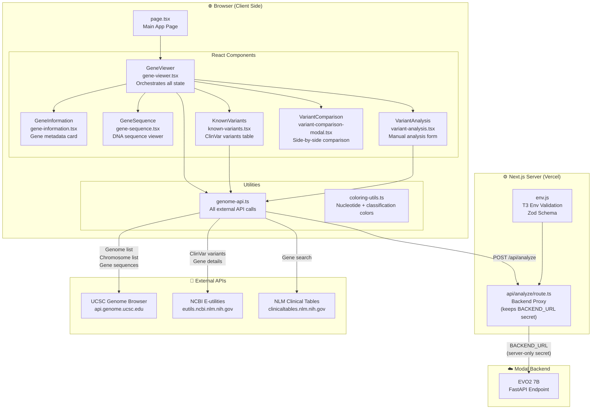
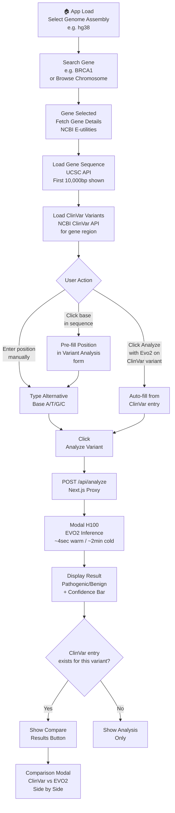
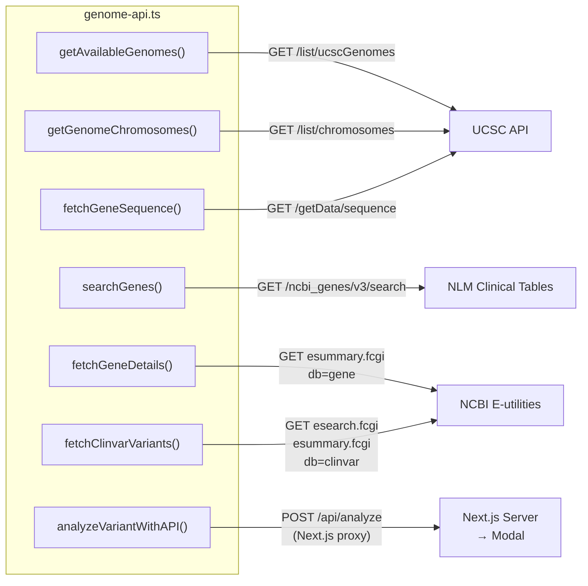

# DeepScope — Frontend

> Next.js Web Interface for Genomic Variant Analysis

This is the frontend for DeepScope — a responsive, modern web application for exploring genomes, browsing genes, and predicting the pathogenicity of DNA mutations using the EVO2 AI model.

**Built by: Priyanshu Paul** — Full-Stack Engineer, Frontend Development, API Integration & Data Pipeline

---

## 🏗️ Frontend Architecture



---

## 🔄 User Interaction Flow



---

## 📁 File Structure

```
evo2-frontend/
├── src/
│   ├── app/
│   │   ├── api/
│   │   │   └── analyze/
│   │   │       └── route.ts        # Server-side proxy to Modal
│   │   ├── layout.tsx              # Root layout
│   │   └── page.tsx                # Main page
│   ├── components/
│   │   ├── ui/                     # Shadcn UI primitives
│   │   │   ├── button.tsx
│   │   │   ├── card.tsx
│   │   │   ├── input.tsx
│   │   │   ├── select.tsx
│   │   │   ├── table.tsx
│   │   │   └── tabs.tsx
│   │   ├── gene-information.tsx    # Gene metadata display
│   │   ├── gene-sequence.tsx       # Interactive DNA sequence viewer
│   │   ├── gene-viewer.tsx         # Main orchestrator component
│   │   ├── known-variants.tsx      # ClinVar variants table
│   │   ├── variant-analysis.tsx    # Manual variant input + results
│   │   └── variant-comparison-modal.tsx  # ClinVar vs EVO2 comparison
│   ├── lib/                        # Utility functions
│   ├── styles/                     # Global styles
│   ├── utils/
│   │   ├── genome-api.ts           # All API call functions
│   │   └── coloring-utils.ts       # Color helpers
│   └── env.js                      # T3 env validation (Zod)
├── public/                         # Static assets
├── .env.example                    # Environment variable template
├── .env                            # Local secrets (gitignored)
├── next.config.js                  # Next.js configuration
├── package.json                    # Dependencies
├── tailwind.config.js              # Tailwind CSS config
└── tsconfig.json                   # TypeScript config
```

---

## 🔌 API Integration Map



---

## ⚙️ Setup

### Prerequisites
- Node.js 20+
- npm 10+

### Installation

```bash
# Install dependencies
npm install

# Copy environment file
cp .env.example .env
```

### Environment Variables

Create `.env` in the `evo2-frontend/` directory:

```env
# Modal backend deployment URL (server-only, never exposed to browser)
BACKEND_URL=https://your-username--genome-analysis-v2-evo2model-analyze-single-variant.modal.run

# Frontend API route (always /api/analyze)
NEXT_PUBLIC_ANALYZE_SINGLE_VARIANT_BASE_URL=/api/analyze
```

### Development

```bash
npm run dev
# Opens at http://localhost:3000
```

### Production Build

```bash
npm run build
npm start
```

---

## 🚀 Deployment (Vercel)

1. Push code to GitHub
2. Go to https://vercel.com → New Project
3. Import repository
4. Set **Root Directory** to `evo2-frontend`
5. Add environment variables:
   - `BACKEND_URL` = your Modal endpoint URL
   - `NEXT_PUBLIC_ANALYZE_SINGLE_VARIANT_BASE_URL` = `/api/analyze`
6. Click Deploy

---

## 🔒 Security — Why the Proxy Pattern

The `BACKEND_URL` (Modal endpoint) is kept **server-side only**. Direct browser → Modal calls would:
- Expose the endpoint URL publicly
- Cause CORS errors
- Risk abuse of the GPU endpoint

The `/api/analyze` proxy route handles this securely:

```
Browser → /api/analyze (same origin, safe)
              ↓  server-side only
         Modal endpoint (hidden from browser)
```

---

## 📦 Key Dependencies

```json
{
  "next": "^15.2.3",
  "react": "^19.0.0",
  "tailwindcss": "^4.0.15",
  "@t3-oss/env-nextjs": "^0.12.0",
  "@radix-ui/react-select": "^2.2.2",
  "@radix-ui/react-tabs": "^1.1.8",
  "lucide-react": "^0.501.0",
  "zod": "^3.24.2",
  "clsx": "^2.1.1",
  "tailwind-merge": "^3.2.0"
}
```

---

## 🎨 UI Component Overview

| Component | Description |
|---|---|
| `GeneViewer` | Root component — manages all state, coordinates all child components |
| `GeneInformation` | Displays gene name, description, organism, chromosome location |
| `GeneSequence` | Interactive nucleotide-by-nucleotide DNA sequence display with click-to-select |
| `KnownVariants` | Paginated ClinVar variants table with inline EVO2 analysis buttons |
| `VariantAnalysis` | Manual position + alternative input form, shows delta score and confidence bar |
| `VariantComparisonModal` | Side-by-side ClinVar classification vs EVO2 prediction overlay |

---